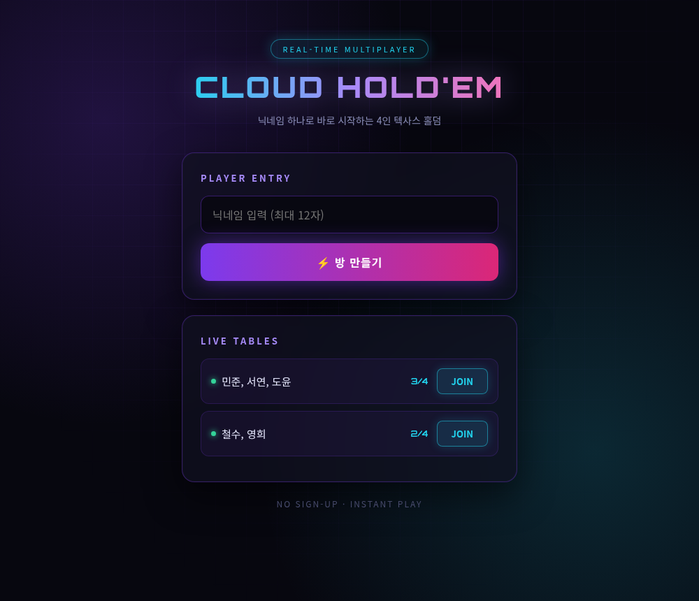
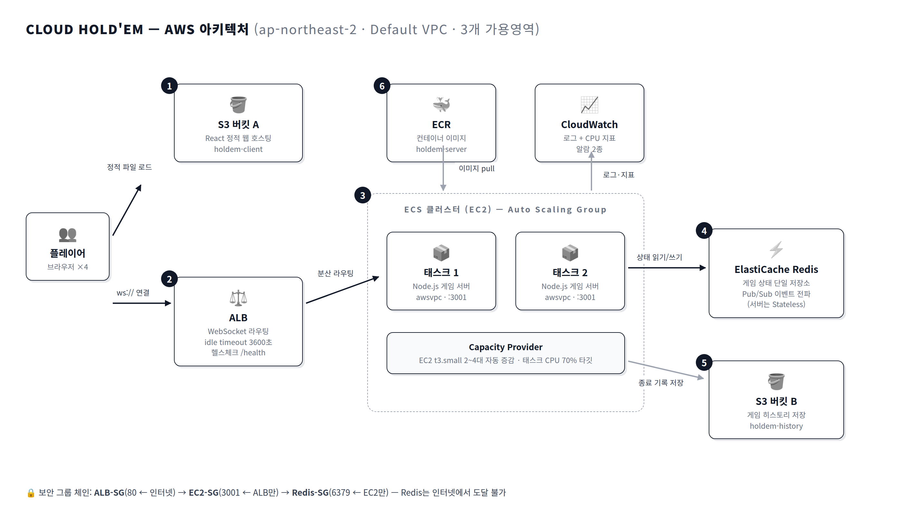

# 🃏 Cloud Hold'em

> AWS ECS 기반 실시간 멀티플레이어 텍사스 홀덤 — 회원가입 없이 닉네임만으로 4인 플레이

**🎮 플레이:** http://holdem-client-026951011097.s3-website.ap-northeast-2.amazonaws.com



## 특징

- **즉시 플레이** — 회원가입·로그인 없이 닉네임만 입력하면 방 생성/입장
- **실시간 4인 멀티플레이** — WebSocket 양방향 통신, 20초 턴 타이머(초과 시 자동 폴드)
- **다중 테이블** — 여러 게임 동시 진행
- **끊겨도 이어서** — 새로고침/재접속 시 진행 중이던 게임에 자동 복귀
- **완전한 Stateless 서버** — 게임 상태는 전부 Redis에. 서버가 죽어도 게임은 보존

## 아키텍처



```
브라우저 ──(정적 파일)── S3 버킷 A (React 정적 호스팅)
   │
   └──(ws://)── ALB ── ECS 클러스터 (EC2, 태스크 2~8개)
                              │
                        ElastiCache Redis ── 게임 상태 + Pub/Sub
                              │
                        S3 버킷 B (게임 히스토리)
```

| 구성요소 | 선택 | 이유 |
|---|---|---|
| 컨테이너 오케스트레이션 | **ECS on EC2** | EKS 대비 관리비 $73/월 절감, Fargate 대비 상시 가동 비용 우위 |
| 로드밸런서 | **ALB** (idle timeout 3600s) | WebSocket 장시간 연결 유지, L7 헬스체크 |
| 상태 저장소 | **ElastiCache Redis** | 서버 Stateless화의 핵심 — sticky session 불필요 |
| 오토스케일링 | **2단** (Service CPU 70% + Capacity Provider) | 컨테이너와 EC2가 각각 자동 증감 |
| 보안 | SG 참조 체인 + IAM 역할 3종 분리 | Redis는 인터넷에서 도달 불가 |

자세한 내용: [발표 자료](docs/presentation/) · [ECS 전환 플랜](docs/superpowers/plans/2026-05-23-ecs.md)

## 기술 스택

**Backend** Node.js 20 · ws · ioredis (Lua 스크립트로 원자적 상태 업데이트)
**Frontend** React 18 · Vite (네온 아케이드 테마)
**Infra** AWS ECS(EC2) · ALB · ElastiCache · S3 ×2 · ECR · CloudWatch — ap-northeast-2

## 로컬 실행

```bash
# 1. Redis
docker run -d -p 6379:6379 --name holdem-redis redis:7

# 2. 백엔드 (ws://localhost:3001)
cd server && npm install && npm start

# 3. 프론트엔드 (http://localhost:5173)
cd client && npm install && npm run dev

# 4. 브라우저 탭 4개 → http://localhost:5173 → 닉네임 입력 → 플레이
```

## 테스트

```bash
# 단위/통합 테스트 52개 (게임 엔진·Redis·WebSocket 핸들러) — Redis 필요
cd server && npm test

# 4인 풀게임 WebSocket 시뮬레이션 (~10초)
node server/scripts/sim-4p.cjs [ws://주소]

# 실제 브라우저 탭 4개 E2E — 로비→게임→쇼다운→다음 핸드 (스크린샷 포함)
node client/e2e/ui-test.cjs [http://주소]
```

게임 엔진(핸드 평가·베팅 라운드·팟 분배)은 TDD로 작성되었습니다.

## AWS 배포

인프라는 `infra/ecs/` 스크립트로 순서대로 구축합니다 (IAM 권한: [required-iam-permissions.json](infra/required-iam-permissions.json)):

```bash
PROFILE=<프로필> bash infra/ecs/00-redis.sh      # ElastiCache
PROFILE=<프로필> bash infra/ecs/01-iam.sh        # IAM 역할 3종
PROFILE=<프로필> bash infra/ecs/02-cluster.sh    # ECS 클러스터 + ASG
PROFILE=<프로필> bash infra/ecs/03-task-def.sh   # Task Definition
PROFILE=<프로필> bash infra/ecs/04-alb.sh        # ALB + Target Group
PROFILE=<프로필> bash infra/ecs/05-service.sh    # ECS Service + Auto Scaling
PROFILE=<프로필> bash infra/ecs/06-alarms.sh     # CloudWatch 알람
```

**백엔드 재배포** (무중단 롤링):
```bash
docker build -t holdem-server ./server
docker tag holdem-server <ECR주소>/holdem-server:latest && docker push <ECR주소>/holdem-server:latest
aws ecs update-service --cluster holdem-cluster --service holdem-service --force-new-deployment
```

**프론트엔드 배포**:
```bash
cd client && VITE_WS_URL="ws://<ALB주소>" npm run build
aws s3 sync dist/ s3://holdem-client-026951011097/ --delete
```

**비용 절약** — 안 쓸 때 EC2 끄기:
```bash
aws autoscaling update-auto-scaling-group --auto-scaling-group-name holdem-ecs-asg --min-size 0 --desired-capacity 0
```

## 프로젝트 구조

```
server/
  src/game/        덱·핸드 평가·블라인드·팟·게임 엔진 (순수 로직)
  src/redis/       상태 저장(Lua 원자 업데이트)·Pub/Sub
  src/ws/          WebSocket 메시지 라우터·브로드캐스터
  src/timer/       턴 타이머 (Redis 추적 — 멀티 인스턴스 안전)
  src/history/     게임 결과 S3 저장
  tests/           단위/통합 테스트
client/
  src/pages/       Lobby(로비)·Game(게임 테이블)
  src/components/  카드·좌석·액션 패널·팟
  src/ws/          WebSocket 싱글턴 (자동 재연결 + 신원 유지)
  e2e/             브라우저 E2E
infra/ecs/         AWS 구축 스크립트 (00~06)
docs/              설계 스펙·구현 플랜·발표 자료·디자인 시안
```

## 설계 노트

- **분산 환경 일관성**: 같은 게임의 4명이 서로 다른 ECS 태스크에 접속해도, 상태는 Redis 하나를 공유하고 이벤트는 Pub/Sub으로 전 태스크에 전파됨 — 프로덕션에서 E2E로 검증
- **race condition 방어**: 상태 조회+턴 검증+저장을 Lua 스크립트로 원자 실행, 타이머 만료 처리권은 `GETDEL`로 선점
- **방치된 게임 자동 정리**: 턴 타이머가 auto-fold → 3연속 시 탈락 → game over → 방·상태 삭제까지 사람 없이 진행
